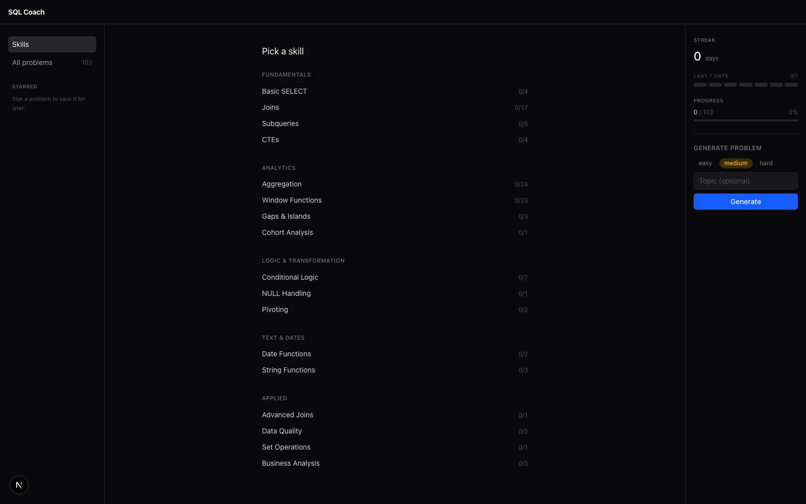
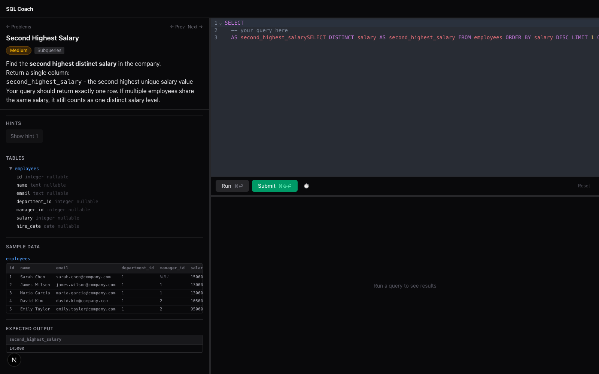
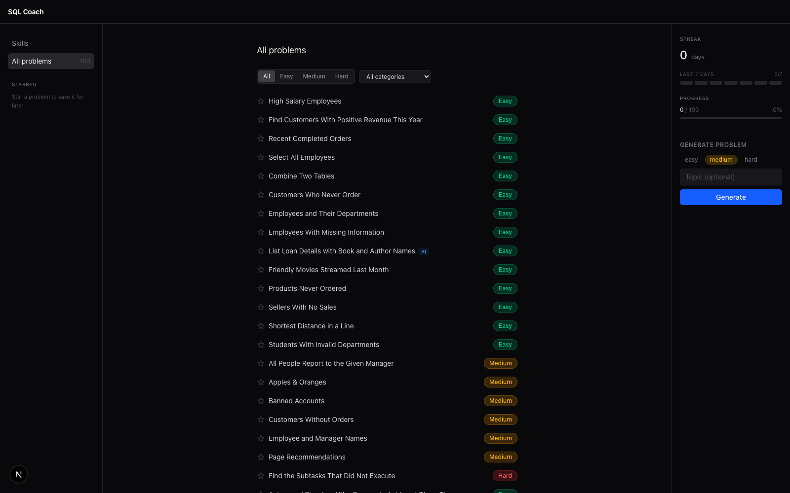

# SQL Coach

A LeetCode-style practice environment for SQL — with a real Postgres database, 100+ interview-grade problems, and a local LLM that coaches you toward the answer without ever handing it over.



## What this is

SQL Coach is a self-hosted, local-first desktop web app for drilling SQL interview problems. You write queries against a live PostgreSQL 17 instance, hit **Run** to see your rows, and hit **Submit** to get checked against a reference solution. If you get stuck, an on-device LLM plays the role of an interviewer who nudges you, names the concept you're missing, and refuses to write the query for you.

It's built for the kind of person who wants to actually *get good* at SQL rather than memorize LeetCode answers — and who would rather run everything locally than pipe their half-baked queries to a cloud service.

## What's interesting about it

A few things set it apart from other SQL practice tools:

- **Real Postgres, not a toy in-memory engine.** Every query runs against `postgres:17-alpine` in Docker. You get real EXPLAIN plans, real error messages, and real behavior for window functions, CTEs, `LATERAL`, `GROUPING SETS`, `generate_series`, and the rest of the modern SQL surface area.
- **A coach, not a cheater.** Coaching happens through a local [Ollama](https://ollama.com) model. The system prompt is tuned (and eval-harness scored) to *never* emit the full solution — it escalates hints across attempts 1, 2, and 3+, praises what you got right, and gently names the missing concept. No cloud calls, no telemetry, no bill.
- **Infinite problems via local generation.** Beyond the 100+ hand-authored problems, you can ask the LLM to generate a fresh problem on any topic and difficulty. It creates the description, schema, seed data, solution, and expected output — then drops you straight into the editor.
- **A real mastery model.** Problems aren't binary solved/unsolved. SQL Coach tracks *attempted → solved → practiced → mastered*, penalizes peeks at the solution, schedules problems for review (spaced repetition), and computes daily streaks.
- **Skill tree, not a list.** Problems are grouped into learning tracks (Fundamentals → Analytics → Logic & Transformation → Text & Dates → Applied), so you can practice window functions without having to scroll past fifty JOIN problems first.
- **Two Postgres roles, by design.** Your queries execute as `coach_readonly` with a 5-second statement timeout — so runaway `CROSS JOIN` or infinite recursive CTE can't wedge your machine. Reference solutions and seeding run as `coach_admin`.
- **Data managed by dbt.** Seeds live in `dbt/seeds/{hr,ecommerce,analytics}/`, loaded via `dbt seed`, with schema routing driven by a `generate_schema_name` macro. Changing or adding a dataset is a YAML edit and a reload, not a migration dance.

### The problem view

A LeetCode-style three-pane layout: problem + schema on the left, CodeMirror 6 SQL editor top-right, live results bottom-right. `⌘↵` to run, `⌘⇧↵` to submit.



### Browse 100+ problems

Filter by difficulty and category, see mastery state at a glance, star the ones you want to come back to.



## Getting started

### Prerequisites

- [Docker](https://www.docker.com/) (for Postgres)
- [Bun](https://bun.sh) (for the Next.js app)
- [uv](https://docs.astral.sh/uv/) (for dbt)
- [Ollama](https://ollama.com) — optional, only needed for coaching chat and problem generation

### Install

```bash
git clone https://github.com/joncooper/sql-coach.git
cd sql-coach
./scripts/setup.sh
```

The setup script will:

1. Start Postgres via `docker compose`
2. Install dbt + dbt-postgres into a local `uv` venv
3. Run `dbt seed` to load the `hr`, `ecommerce`, and `analytics` datasets
4. Run `dbt test` to verify data quality
5. Create the `coach_readonly` role with a 5-second timeout
6. Apply the coaching telemetry schema
7. Install JS dependencies with `bun install`

### Run the dev server

```bash
bun run dev
```

Open http://localhost:3000.

### Enable coaching (optional)

Install Ollama and pull a model:

```bash
brew install ollama
ollama serve &
ollama pull gemma3:latest  # or any chat model you prefer
```

By default the app talks to `http://localhost:11434`. Override with environment variables if needed:

```bash
OLLAMA_URL=http://localhost:11434 OLLAMA_MODEL=gemma3:latest bun run dev
```

When Ollama is reachable, the coaching chat panel and the "Generate problem" button light up automatically.

## How to use it

1. **Pick a skill** from the home page (or jump into "All problems") and choose something at your level.
2. **Read the problem, inspect the schema and sample data** in the left pane. Every problem shows you the tables you can query and what the expected output looks like.
3. **Write your query** in the editor. Autocomplete knows the schema.
4. `⌘↵` runs the query (read-only, 5s timeout) and shows rows.
5. `⌘⇧↵` submits — rows are diffed against the reference solution and you get a pass/fail with any mismatched rows highlighted.
6. **Stuck?** Reveal a hint (there are usually three, from gentle to explicit), or open the coach chat for adaptive, context-aware help.
7. **Track progress** on the right side: daily streak, last-7-days activity heatmap, total solved, and mastery indicators per problem.
8. **Starred and review-due problems** show up in the left sidebar so you can come back to them.

## Architecture

```
┌──────────────────────────────────────────────────────────┐
│  Next.js 16 (App Router) + React 19 + Tailwind 4          │
│  CodeMirror 6 · react-resizable-panels · react-markdown   │
└───────────────┬──────────────────────────────────────────┘
                │
        ┌───────┴────────┐
        │  API routes     │
        │  /api/query     │  run read-only SQL          (coach_readonly)
        │  /api/submit    │  diff vs. reference solution
        │  /api/schema    │  list tables/columns
        │  /api/problems  │  list+load YAML problems
        │  /api/coaching  │  stream LLM hints
        │  /api/llm/*     │  generate problems, status
        └───────┬────────┘
                │
     ┌──────────┴──────────┐
     │                      │
     ▼                      ▼
┌─────────────┐   ┌──────────────────────┐
│ PostgreSQL  │   │ Ollama (local LLM)   │
│   17-alpine │   │  coaching + gen      │
│             │   └──────────────────────┘
│ schemas:    │
│  hr         │   ┌──────────────────────┐
│  ecommerce  │◀──│ dbt seed / dbt test  │
│  analytics  │   └──────────────────────┘
└─────────────┘
```

Key directories:

- `problems/` — YAML problem definitions (100+)
- `dbt/` — dbt project; seeds in `dbt/seeds/{hr,ecommerce,analytics}/`
- `src/app/` — Next.js pages and API routes
- `src/components/` — React components (`SqlEditor`, `ResultsTable`, `CoachingChat`, `SchemaExplorer`, …)
- `src/lib/` — server utilities (`db.ts`, `problems.ts`, `compare.ts`, `ollama.ts`, `stats.ts`, `skill-tree.ts`)
- `src/lib/prompts/` — coaching and problem-generation prompts (eval-harness scored)
- `evals/` — prompt eval harness with tasks, judges, and traces
- `scripts/` — `setup.sh`, `reset-db.sh`, `init-roles.sql`, `init-tracking.sql`

## Adding your own problems

Drop a YAML file into `problems/`:

```yaml
slug: my-new-problem
title: "My New Problem"
difficulty: medium
category: window-functions
tags: [window, rank]
domain: hr
tables: [employees]
description: |
  Find the top-paid employee in each department.
hints:
  - "Think about ranking rows inside each department."
  - "ROW_NUMBER() OVER (PARTITION BY ... ORDER BY ...)"
  - "Filter where the rank equals 1."
starter_code: |
  SELECT ...
order_matters: false
solution: |
  SELECT department_id, name, salary
  FROM (
    SELECT *, ROW_NUMBER() OVER (PARTITION BY department_id ORDER BY salary DESC) AS rn
    FROM employees
  ) ranked
  WHERE rn = 1;
expected_columns: [department_id, name, salary]
```

Then restart the dev server. If you reference new tables, add seeds under `dbt/seeds/<domain>/` and re-run `cd dbt && .venv/bin/dbt seed`.

## Commands

| Command | What it does |
| --- | --- |
| `./scripts/setup.sh` | Full bootstrap (Postgres + dbt + seeds + deps) |
| `bun run dev` | Dev server at http://localhost:3000 |
| `bun run build` | Production build |
| `./scripts/reset-db.sh` | Destroy and rebuild the database |
| `cd dbt && .venv/bin/dbt seed` | Reload seed data |
| `cd dbt && .venv/bin/dbt test` | Run data quality tests |

## Tooling conventions

This project uses **bun** for all JS/TS, **uv** for all Python, and **jq** for all JSON. No `npm`/`yarn`/`pnpm`, no `pip`, no ad-hoc `python -c` / `node -e`.

## Viewport

Desktop only. The UI is tuned for a three-pane layout and a real keyboard — mobile and tablet are intentionally unsupported.

## License

[MIT](LICENSE) © Jon Cooper
